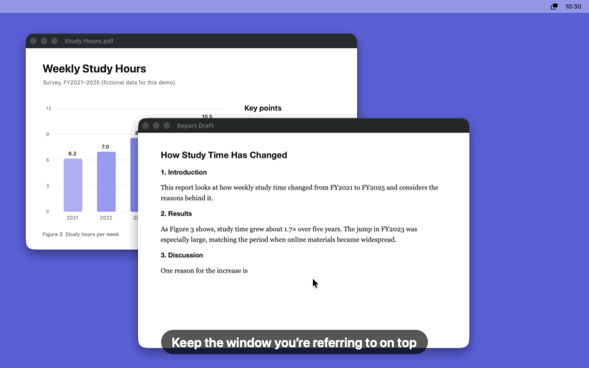
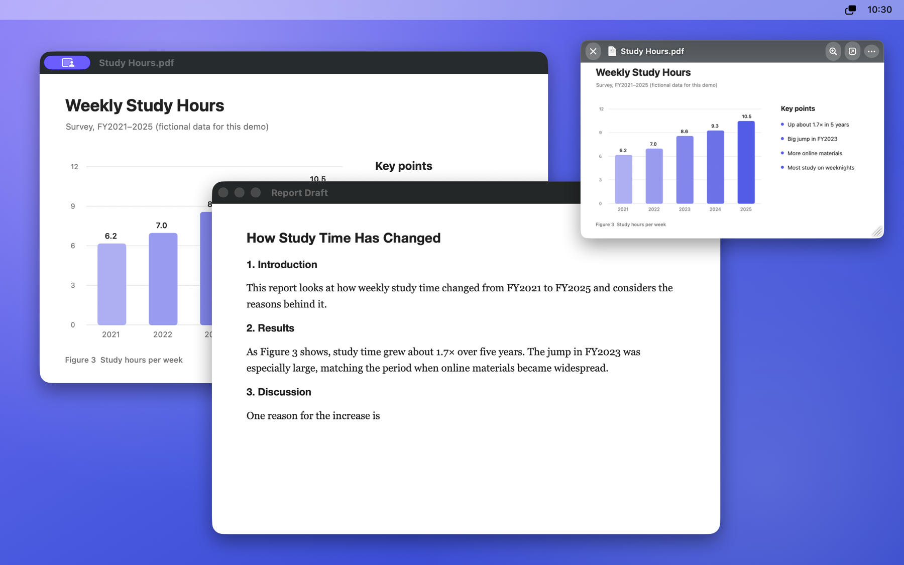
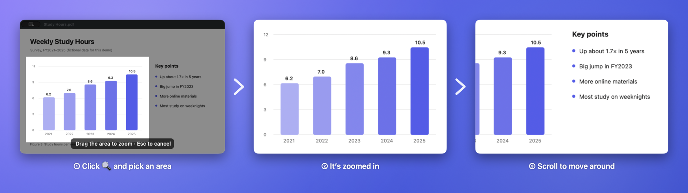

<p align="center"></p>

<h1 align="center">SideWindow</h1>

<p align="center">Keep the window you’re referring to always on top.</p>

<p align="center">
  <a href="https://github.com/Izu-TABI/SideWindow/releases/latest"></a>
  
  <a href="LICENSE"></a>
  <a href="https://github.com/Izu-TABI/SideWindow/releases"></a>
</p>

<p align="center">English | <a href="README.md">日本語</a></p>

<p align="center"></p>

SideWindow is a macOS menu bar app that keeps any window always on top — like PowerToys’ Always On Top on Windows, but for any app on your Mac. It’s made for keeping reference material in view: a document while you write a report, a video call while you take notes, and so on. It mirrors the window you choose into a small floating panel, and even when the original window is buried behind others, the panel keeps showing it live.

## Features

- **No permissions needed**: works without Screen Recording or Accessibility access, because you pick windows with the system window picker.
- **Zoom into what you need**: pick an area to zoom in, then scroll to move around.
- **Stays out of your way**: hides itself while the original window is in front, and can be made translucent or click-through.
- **No network access**: never connects to the internet, and never collects or sends any data.
- **Free and open source**: MIT license, with English and Japanese UI.



## Download

**[Download SideWindow.zip](https://github.com/Izu-TABI/SideWindow/releases/latest/download/SideWindow.zip)** (macOS 15.2 or later, Apple silicon / Intel)

1. Open the zip and move `SideWindow.app` to your Applications folder.
2. Open `SideWindow.app`. Because the app isn’t notarized by Apple, the first launch shows a warning that it can’t be opened — click Done.
3. Open System Settings → Privacy & Security, scroll down, and click Open Anyway next to SideWindow. Confirm with Open Anyway again.

If you use Terminal, you can also install it with Homebrew (you’ll still need to click Open Anyway on first launch):

```bash
brew install --cask izu-tabi/tap/sidewindow
```

You’re ready when the welcome guide appears. The app follows your Mac’s language settings: it’s shown in Japanese if Japanese comes before English in your preferred languages, and in English otherwise. Older versions are on the [Releases](https://github.com/Izu-TABI/SideWindow/releases) page.

## How to use

1. Choose **Pin a Window…** from the SideWindow menu bar icon, or press **⌃⌥P**.
2. Click the window you want to keep on top.
3. The panel flies out of the original window and settles at the top right of the screen (or wherever you put the last one).

### Zoom into what you need



Hover over the panel and click 🔍, then drag over an area. The panel keeps its size and shows that area enlarged. While zoomed, scroll to move around. Click 🔍 again to zoom in further.

### Controls

| Action | What it does |
|---|---|
| Drag | Move (snaps to the edges of the screen) |
| Drag an edge or corner / pinch / ⌘ + scroll | Resize (keeps the aspect ratio) |
| 🔍 button → drag | Zoom into the area. Click again while zoomed to zoom in further |
| Scroll while zoomed | Move the zoomed area |
| ⤢ button | Show the whole window again |
| Double-click | Open the original window |
| ⌥ + scroll | Opacity (the panel turns opaque while you hover over it) |
| ••• button / right-click | More options (size, opacity, click-through, and more) |
| ⌃⌥H | Hide or show all pinned panels |

- While the original window is in front, the panel hides itself.
- When the original is minimized, its app is hidden, or another tab is selected, the panel dims the last frame and tells you why. If the original window is closed, the panel goes away too.
- With **Click Through** on, clicks go to the window below the panel. Hold ⌘ to use the panel.
- You can turn on **Open at Login** from the menu bar icon.

## How it works and limitations

- macOS has no public API for keeping another app’s window on top, so SideWindow shows a live capture made with ScreenCaptureKit. You can’t scroll or type in the panel itself — use the original window (double-click the panel to jump to it).
- Some apps stop drawing while their window is hidden or on another desktop (browsers, video players, Electron apps, and so on), and the panel stops updating with them. macOS itself keeps capturing hidden windows, so this is the app saving power. Bring the original window to the front (double-click the panel) and it updates again.
- Windows are chosen with the system window picker, so no Screen Recording permission is needed. While a window is pinned, macOS shows its screen-sharing indicator in the menu bar and on the original window.
- macOS doesn’t draw minimized windows, so they can’t be shown.
- Browsers may stop drawing video when its window is completely hidden. For video, Picture in Picture works better.
- Zooming can’t add detail beyond the original window’s pixels. For windows on non-Retina displays, SideWindow sharpens the zoomed view as much as it can.
- Granting accessibility access (optional) lets SideWindow reliably restore minimized windows.
- To detect window states and to show the right pointer while it runs in the background, SideWindow uses private APIs that window-management apps widely rely on.

## Building from source

### Requirements

- macOS 15.2 or later
- Xcode Command Line Tools (Xcode itself isn’t required)

### Build and run

```bash
./scripts/build.sh --run
```

Builds `build/SideWindow.app` and opens it.

```bash
./scripts/build.sh --install
```

Installs the app to `/Applications` and opens it.

### Tests

```bash
./scripts/test.sh
```

Unit tests for the position, size, and capture-area calculations.

```bash
./scripts/selftest.sh
```

End-to-end tests that drive a real panel — moving, resizing, zooming, scrolling, minimizing, switching tabs, auto-hiding, the pointer while running in the background, and more — using test windows it creates itself. The test windows stay on screen for a minute or two, and screenshots are saved to `build/selftest`. To check the English UI (including untranslated text), run:

```bash
./scripts/selftest.sh build/selftest-en -AppleLanguages "(en)"
```

### Regenerating the README images

```bash
./scripts/screenshots.sh
```

Lays out fictional document and report windows, actually pins one, captures only SideWindow’s own windows, and composites them into the README images, the animated demo GIF, and the social preview, in both Japanese and English. It never captures the whole screen, so no other apps or personal information show up.

### Publishing a release

Bump `CFBundleShortVersionString` in `Resources/Info.plist`, commit, and push. Then run:

```bash
./scripts/release.sh
```

It builds a universal app for Apple silicon and Intel, publishes a `v<version>` GitHub release with `SideWindow.zip` attached, and then updates the Homebrew tap ([Izu-TABI/homebrew-tap](https://github.com/Izu-TABI/homebrew-tap)) to the new version.

## Project layout

```
Sources/SideWindow/
├── main.swift            Startup (plus the --selftest and --demo developer modes)
├── AppDelegate.swift     Menu bar, choosing windows, hotkeys
├── WelcomeWindow.swift   Welcome guide, Open at Login
├── PinController.swift   One pinned window (capture, watching the original, zoom, menu)
├── MirrorView.swift      Panel appearance and interaction (move, resize, area selection, controls)
├── FrameScaler.swift     Sharper zoomed view (Lanczos resampling and edge enhancement)
├── SourceWindow.swift    State of the original window (minimized, tabs, closed) and bringing it forward
├── Geometry.swift        Position, size, and capture-area calculations
├── Preferences.swift     Settings carried over to new panels
├── Localization.swift    English translations
├── PinPanel.swift        The always-on-top panel
├── HotKey.swift          Global hotkeys
├── StatusIcon.swift      Menu bar icon
├── BackgroundCursor.swift  Lets the pointer change shape while the app is in the background
├── SelfTest.swift        End-to-end tests with a real panel
└── DemoScene.swift       README image generation
Tests/SideWindowTests/    Tests for the position, size, and capture-area calculations
scripts/                  Build, tests, end-to-end tests, images, releases, icon generation
docs/images/              README images
```

## License

[MIT License](LICENSE)
