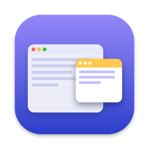
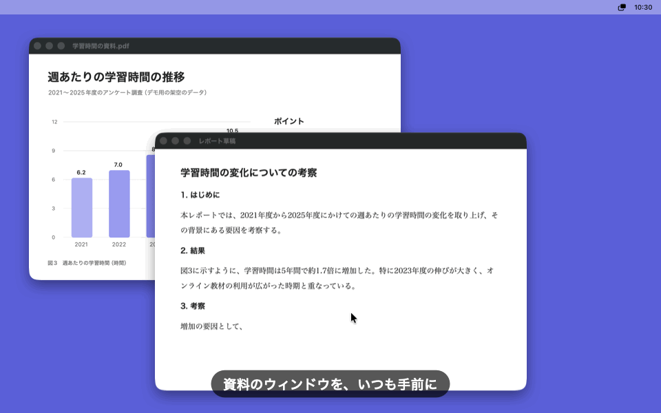
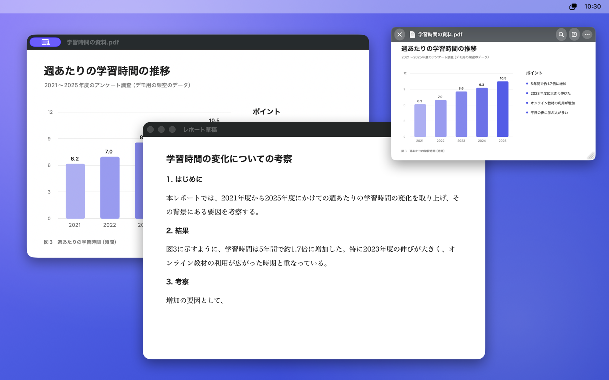
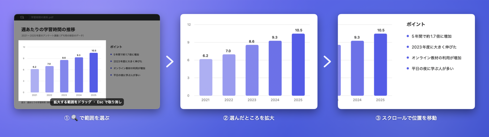

<p align="center"></p>

<h1 align="center">SideWindow</h1>

<p align="center">参照したいウィンドウを、いつも手前に。</p>

<p align="center">
  <a href="https://github.com/Izu-TABI/SideWindow/releases/latest"></a>
  
  <a href="LICENSE"></a>
  <a href="https://github.com/Izu-TABI/SideWindow/releases"></a>
</p>

<p align="center"><a href="README.en.md">English</a> | 日本語</p>

<p align="center"></p>

Mac で、選んだウィンドウを常に最前面（いつも手前）に表示するメニューバーアプリです。Windows の PowerToys にある「Always On Top」のようなことを、Mac のどのアプリのウィンドウでもできます。レポートを書きながら資料を見る、会議の映像を横に置いておく、といった使い方に向いています。元のウィンドウがほかのウィンドウの後ろに隠れていても、パネルにはずっと映り続けます。

## 特長

- **許可が要らない**：「画面収録」も「アクセシビリティ」も許可せずに使えます（ウィンドウはシステムのピッカーで選ぶため）。
- **見たいところを拡大**：範囲を選んで拡大し、スクロールで位置を動かせます。
- **邪魔にならない**：元のウィンドウを手前で見ているあいだは自動で隠れます。半透明やクリック透過にもできます。
- **通信しない**：ネットワークには一切接続しません。データを集めたり送ったりもしません。
- **無料・オープンソース**：MIT ライセンス。日本語と英語に対応しています。



## ダウンロード

**[SideWindow.zip をダウンロード](https://github.com/Izu-TABI/SideWindow/releases/latest/download/SideWindow.zip)**（macOS 15.2 以降、Apple シリコン / Intel）

1. zip を開き、`SideWindow.app` を「アプリケーション」フォルダに移動します。
2. `SideWindow.app` を開きます。Apple の公証を受けていないため、初回は「開いていません」という警告が出るので「完了」を押します。
3. 「システム設定」→「プライバシーとセキュリティ」を開き、下の方にある SideWindow の「このまま開く」を押します。もう一度確認が出たら「このまま開く」を押します。

ターミナルを使う場合は、Homebrew でも入れられます（初回の「このまま開く」は同じく必要です）。

```bash
brew install --cask izu-tabi/tap/sidewindow
```

使い方の案内が開いたら準備完了です。表示は Mac の言語設定に合わせて日本語か英語になります（日本語が英語より上にあれば日本語）。過去のバージョンは [Releases](https://github.com/Izu-TABI/SideWindow/releases) にあります。

## 使い方

1. メニューバーの SideWindow アイコンから「ウィンドウを固定…」を選ぶか、**⌃⌥P** を押します。
2. 手前に置きたいウィンドウをクリックします。
3. パネルが元のウィンドウの場所から飛んできて、画面の右上（前回置いた場所）に収まります。

### 見たいところを拡大する



パネルにマウスを乗せると出るボタンの 🔍 で範囲をドラッグすると、パネルの大きさはそのままで、選んだところが拡大されます。拡大中はスクロールで映す位置を動かせます。もう一度 🔍 を押すと、さらに拡大できます。

### 操作の一覧

| 操作 | 動作 |
|---|---|
| ドラッグ | 移動（画面の端に吸い付く） |
| 端・角をドラッグ／ピンチ／⌘ + スクロール | サイズ変更（縦横比は保つ） |
| 🔍 ボタン → ドラッグ | 選んだ範囲を拡大。拡大中にもう一度押すとさらに拡大 |
| 拡大中にスクロール | 映す位置を動かす |
| ⤢ ボタン | 全体表示に戻す |
| ダブルクリック | 元のウィンドウを開く |
| ⌥ + スクロール | 不透明度（マウスを乗せているあいだは不透明になる） |
| ••• ボタン／右クリック | その他の操作（サイズ・不透明度・クリック透過など） |
| ⌃⌥H | 固定中のパネルをすべて隠す・表示する |

- 元のウィンドウを手前で見ているあいだ、パネルは自動で隠れます。
- 最小化・アプリの非表示・別のタブへの切り替え中は、最後の映像を暗くして案内を出します。元のウィンドウが閉じられたら、固定も外れます。
- 「クリックを透過」をオンにすると、パネルの下のウィンドウを操作できます。⌘ を押しているあいだはパネルを操作できます。
- ログイン時の起動は、メニューバーのアイコンから設定できます。

## 仕組みと制限

- macOS には、ほかのアプリのウィンドウを最前面にする公開 API がありません。そのため ScreenCaptureKit で取り込んだ映像を映しています。パネルの上ではスクロールや文字の入力はできないので、元のウィンドウで操作してください（ダブルクリックで開けます）。
- 元のウィンドウが隠れたり別のデスクトップに移ったりすると、描画をやめるアプリがあります（ブラウザ・動画プレーヤー・Electron 製のアプリなど）。そのあいだはパネルの表示も止まります。macOS 自体は隠れたウィンドウも取り込み続けるので、これは元のアプリの省電力の動きです。元のウィンドウを手前に出すと（パネルをダブルクリック）、また更新されます。
- ウィンドウ選びにはシステムのピッカーを使うので、「画面収録」の許可は要りません。固定中は、メニューバーと元のウィンドウに画面共有中の印が出ます（macOS の仕様）。
- 最小化したウィンドウは macOS が描画しないため映りません。
- 動画は、元のウィンドウが完全に隠れるとブラウザが描画を止めることがあります。動画にはピクチャ・イン・ピクチャが向いています。
- 拡大しても、元のウィンドウの画素数より細かくはなりません。非 Retina の画面にあるウィンドウは、高画質化の処理でできるだけくっきり見せます。
- アクセシビリティを許可すると（任意）、最小化したウィンドウを確実に元に戻せます。
- ウィンドウの状態の判定と、背面でのポインタの表示に、ウィンドウ管理アプリが広く使っている非公開 API を使っています。

## ソースからビルドする

### 必要なもの

- macOS 15.2 以降
- Xcode の Command Line Tools（Xcode 本体は不要）

### ビルドと起動

```bash
./scripts/build.sh --run
```

`build/SideWindow.app` を作って起動します。

```bash
./scripts/build.sh --install
```

`/Applications` にインストールして起動します。

### テスト

```bash
./scripts/test.sh
```

位置・大きさ・取り込み範囲の計算の単体テストです。

```bash
./scripts/selftest.sh
```

実際のパネルを動かす動作テストです。移動・リサイズ・拡大・スクロール・最小化・タブの切り替え・自動で隠す・背面でのポインタなどを、自分で作ったテスト用のウィンドウで確かめます。テスト用のウィンドウが 1〜2 分表示されます。スクリーンショットは `build/selftest` に保存されます。英語の画面（訳し忘れがないかも含めて）を確かめるときは、次のように実行します。

```bash
./scripts/selftest.sh build/selftest-en -AppleLanguages "(en)"
```

### README の画像を作り直す

```bash
./scripts/screenshots.sh
```

架空の資料とレポートのウィンドウを並べて実際に固定し、SideWindow 自身のウィンドウだけを撮って合成します（日本語版と英語版の画像・動くデモの GIF・ソーシャルプレビュー）。画面全体は撮らないので、ほかのアプリや個人の情報は写りません。

### リリースを出す

`Resources/Info.plist` の `CFBundleShortVersionString` を上げてコミット・push してから実行します。Apple シリコンと Intel の両方で動く版を作り、`SideWindow.zip` を添付した `v<バージョン>` のリリースを GitHub に公開します。最後に Homebrew の tap（[Izu-TABI/homebrew-tap](https://github.com/Izu-TABI/homebrew-tap)）も新しいバージョンに更新します。

```bash
./scripts/release.sh
```

## 構成

```
Sources/SideWindow/
├── main.swift            起動処理（開発用の --selftest・--demo も）
├── AppDelegate.swift     メニューバー、ウィンドウ選び、ホットキー
├── WelcomeWindow.swift   初回の案内、ログイン時の起動
├── PinController.swift   固定したウィンドウ 1 つ分（取り込み・見張り・拡大・メニュー）
├── MirrorView.swift      パネルの見た目と操作（移動・リサイズ・範囲選択・操作バー）
├── FrameScaler.swift     拡大表示の高画質化（Lanczos 補間と輪郭の強調）
├── SourceWindow.swift    元のウィンドウの状態（最小化・タブ・閉じられた）と前面表示
├── Geometry.swift        位置・大きさ・取り込み範囲の計算
├── Preferences.swift     次のパネルにも引き継ぐ設定
├── Localization.swift    英語の表示
├── PinPanel.swift        最前面に浮かぶパネル
├── HotKey.swift          グローバルホットキー
├── StatusIcon.swift      メニューバーのアイコン
├── BackgroundCursor.swift  背面にいてもポインタの形を変えられるようにする
├── SelfTest.swift        実際のパネルを使った動作テスト
└── DemoScene.swift       README の画像づくり
Tests/SideWindowTests/    位置・大きさ・取り込み範囲の計算のテスト
scripts/                  ビルド、テスト、動作テスト、画像づくり、リリース、アイコン生成
docs/images/              README の画像
```

## ライセンス

[MIT License](LICENSE)
